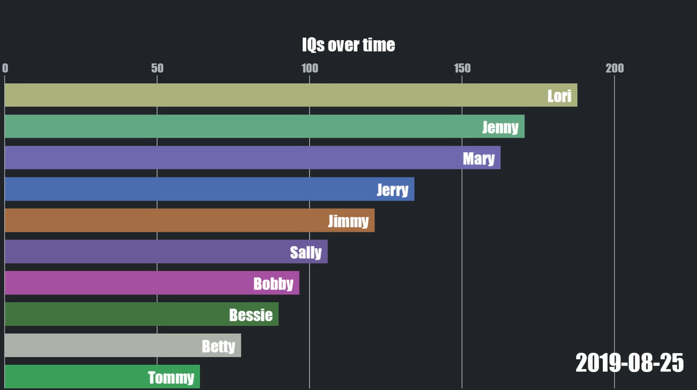

# Data Animations

**You have wandered into a side branch! Please go back to the `main` branch to
learn about this project.**



Using [pyglet][3] as a multimedia library.

## Quick Start

```bash
# Create virtual environment
$ python -m venv venv
# Activate for Linux, OS X users
$ source venv/bin/activate
# Activate for Windows users
$ source venv/Scripts/activate
# Check Python 3.10.8 is used. Some scripts may fail on Python 3.11
$ python
Python 3.10.8
>>> exit()
# Install requirements
$ pip install -r requirements.txt
```

After setting up the environment, let's try a test run. This animation is ~30
seconds.
```bash
$ python main.py
```

Cool! Now, let's try to save this animation as a video. Run the following
command. You may find the window is too large to fit on your screen (depending
on your display size), but that's OK! Simply wait until it finishes running.
**You can also let it run in the background.** (You can even drag the window and
it will not affect the final video.) Alternatively, you can close the window
before the animation finishes, but only part of the animation gets saved.
```bash
$ python main.py -prod
```

You can find the saved video under `out/video.mp4`.

## Usage Guide

See [Quick Start](#quick-start) to set up the environment.

Run the following command for a description of usage options. We also provide a
example below. To use your own dataset, place the file under `data/`, then
specify the file with `-data` flag. Only `.csv` files are supported. **The
program assumes the 1st column specifies the progress or timeline (e.g. date).**
```bash
$ python main.py -h
usage: main.py [-h] [-data DATA] [-title TITLE] [-fpe FPE] [-visible VISIBLE] [-prod] [-out OUT]

options:
  -h, --help        show this help message and exit
  -data DATA        Input data filename (without extension). Must be .csv and reside in data/. (default: example)
  -title TITLE      Title displayed in video. (default: IQs over time)
  -fpe FPE          Frames per entry. A larger value results in slower animation. (default: 2.5)
  -visible VISIBLE  Number of top visible features. (default: 10)
  -prod             If True, enter production mode to record and save animation as .mp4 file. (default: False)
  -out OUT          If in production mode, specifies output filename (without extension). (default: video)
```

### Example

Let's use the example data, but make the animation really fast! Let's also show
more data.
```bash
$ python main.py -data example -title "Fast Animation: IQs over time" -fpe 0.5 -visible 14
```

Cool! Now, let's render the video and save it. (You can let the video run in the
background.)
```bash
$ python main.py -data example -title "Fast Animation: IQs over time" -fpe 0.5 -visible 14 -prod -out speedyvid
```

### Advanced Settings

This project decouples the GUI (view) from the logic (model). Some settings are
set as constants in `model/const.py` and `view/const.py`. You can customise
these settings as follows. Note the `DEFAULT` constants are not necessary to
change, as they can be changed through the command line interface.

```py
# model/const.py
DIR_IN       # The program searches this directory for the dataset
DIR_OUT      # Videos are output in this directory

# view/const.py
FPS         # Frames per second of video
WINDOW_W    # Window width
WINDOW_H    # Window height
```

A lot of the layout and visuals (e.g. bar width, margins, font size) are
hardcoded in files within `view/`, most notably within `view/gui.py`. You can
update the visuals to your preferences by modifying the code there.

### Very advanced settings

If your custom dataset does not meet the requirements, I recommend preprocessing
it.

Since this project decouples the GUI and logic, you only need to modify the code
in `model/data_handler.py` to preprocess your custom dataset.

I recommend creating a method `preprocess_data` in `DataHandler` and calling it
in the constructor immediately after `self.data =
pd.read_csv(os.path.join(DIR_IN, f"{filename}.csv"))`. This method should be
written to modify `self.data` to meet the requirements.

Example coming soon!

## Credits

Inspired by @carykh's drawer written in Processing ([repo][1] and
[tutorial][2]). If you are a beginner, I fully recommend his tutorial as it is
simple and easy to follow. That said, I have extended many features and made
numerous improvements in optimisation and code hygiene.

@carykh also has a YouTube channel @ [Abacaba][4] with many data visualisation
videos.

[1]: https://github.com/carykh/AbacabaTutorialDrawer
[2]: https://www.youtube.com/playlist?list=PLsRQr3mpFF3Khoca0cXA8-_tSloCwlZK8
[3]: https://pyglet.readthedocs.io/en/latest/
[4]: https://www.youtube.com/@Abacaba

## Contribute

### Update Requirements

```bash
$ pip freeze > requirements.txt
```
